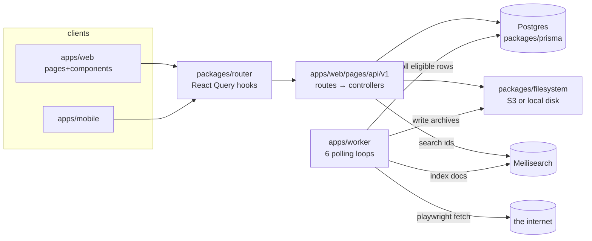

# System Map

## Shape: Yarn 4 workspaces monorepo

Declared in [package.json](../../../package.json) `workspaces: ["apps/*", "packages/*"]`.

```
linkwarden/
├─ apps/
│  ├─ web/      @linkwarden/web     Next.js (pages router) — UI + ALL API routes
│  ├─ worker/   @linkwarden/worker  long-running Node process (tsx) — archiving, AI tags, indexing, RSS, emails
│  └─ mobile/   React Native/Expo app (not covered in depth here)
├─ packages/
│  ├─ prisma/      schema.prisma + 93 migrations + client  (the data contract)
│  ├─ lib/         zod schemas, SSRF guard, safeFetch, meili client, mail, utils
│  ├─ router/      React Query hooks shared by web + mobile (the client data layer)
│  ├─ filesystem/  S3-or-local file storage abstraction
│  └─ types/       shared TS types (global.ts) incl. enums like ArchivedFormat
├─ docs/           product/learning docs (pre-existing; this curriculum lives in docs/upskill)
├─ Dockerfile, docker-compose.yml, .env.sample, vitest.config.mts
└─ .github/workflows/  CI (playwright @login, container release, branch check)
```



The two processes communicate **only through Postgres rows** (and shared file storage). There is no queue, no RPC between web and worker. Hold onto that: it explains most of the architecture.

## Ownership map

| Concern | Lives in | Notes |
| --- | --- | --- |
| UI pages/routes | `apps/web/pages/*.tsx` | pages router; per-page `getServerSideProps` via `apps/web/lib/client/getServerSideProps.ts` |
| UI components | `apps/web/components/` | modals in `ModalContent/`, link rendering in `LinkViews/` |
| Client server-state | `packages/router/` | React Query; **shared with mobile** — no platform imports allowed here |
| Client local state | `apps/web/store/` (zustand: `links.ts`, `localSettings.ts`) + hooks in `apps/web/hooks/` | small by design; server state dominates |
| HTTP API | `apps/web/pages/api/v1/**` | v1 REST-ish; `v2/dashboard` exists — versioning has begun |
| Business logic | `apps/web/lib/api/controllers/**` | one file per operation |
| Authn | `apps/web/pages/api/v1/auth/[...nextauth].ts` + `apps/web/lib/api/verify*.ts` | |
| Authz | `apps/web/lib/api/getPermission.ts`, `setCollection.ts`, `archives/resolveAccessibleArchive.ts` | |
| Validation contracts | `packages/lib/schemaValidation.ts` | zod, shared client+server |
| Data model | `packages/prisma/schema.prisma` | Postgres only (`datasource` line 5-8) |
| Background work | `apps/worker/workers/*` (loops) + `apps/worker/lib/*` (jobs) | |
| File storage | `packages/filesystem/` | env-selected S3 vs local |
| Search | `packages/lib/meilisearchClient.ts`, `apps/web/lib/api/searchQueryBuilder.ts`, `apps/worker/workers/linkIndexing.ts` | optional (null client if unconfigured) |
| Email | `packages/lib/transporter.ts` + `apps/web/lib/api/send*.ts` + worker `trialEndEmailWorker` | optional |
| Billing | `apps/web/lib/api/stripe/*` | optional (cloud offering) |
| Tests | colocated `*.test.ts` (vitest) + `apps/web/e2e/` (playwright) | thin — see [05-quality-engineering/01](../05-quality-engineering/01-testing-strategy.md) |

## Public interfaces vs private internals

**Public (contracts people depend on):** the `/api/v1/**` HTTP API (used by web UI, mobile app, browser extension, and users' scripts via `AccessToken` API keys); the RSS-facing and public-collection routes (`pages/api/v1/public/**` — unauthenticated by design); the Prisma schema (self-hosters' databases survive upgrades via `migrations/`); env var names in `.env.sample`.

**Private (free to refactor):** controllers, `packages/lib` internals, worker internals, component tree. Changing a public surface needs migration thinking; changing a private one needs tests. That distinction — *which of my changes are contract changes?* — is the single most senior question in any diff, and interviewers probe it with "how do you evolve an API without breaking clients?"

## What a senior inspects first (and why)

1. `schema.prisma` — data outlives code.
2. `verifyUser.ts` + `getPermission.ts` — the security spine.
3. `archiveHandler.ts` — the highest-blast-radius code (touches the internet, filesystem, DB).
4. `.github/workflows/` — what's actually enforced (answer: very little — lint/typecheck/unit tests are **not** in CI; only Playwright `@login`).
5. `git log` — normally; unavailable here (fresh init, no commits — see verification log).
